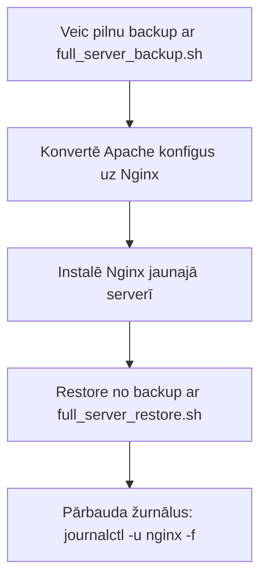

### **🛠️ Apvienotais Backup & Restore Skripts (Viss vienā!)**
Lai izvairītos no konfliktiem un vienkāršotu procesu, es apvienoju visus 4 skriptus vienā:

#### **📌 1. `full_server_backup.sh`** (Backupo VISU: atslēgas, hostname, SSL, timezone, web konfigus)
```bash
#!/bin/bash
# =========================================
# UNIVERSĀLAIS SERVERA BACKUP (Viss 1 failā)
# =========================================

BACKUP_DIR="/root/full_server_backup_$(date +%Y%m%d)"
mkdir -p "$BACKUP_DIR"

# 1. Atslēgas un konfigi (~/.ssh, ~/.config, Docker, Git, GPG, cron)
mkdir -p "$BACKUP_DIR/keys"
cp -r ~/.ssh "$BACKUP_DIR/keys/"
cp ~/.gitconfig "$BACKUP_DIR/keys/" 2>/dev/null
gpg --export-secret-keys > "$BACKUP_DIR/keys/gpg_private.keys" 2>/dev/null
crontab -l > "$BACKUP_DIR/keys/crontab.txt" 2>/dev/null

# 2. Servera iestatījumi (hostname, timezone)
cp /etc/hostname "$BACKUP_DIR/"
timedatectl | grep "Time zone" | awk '{print $3}' > "$BACKUP_DIR/timezone"

# 3. SSL sertifikāti (Let's Encrypt + custom)
mkdir -p "$BACKUP_DIR/ssl"
[ -d "/etc/letsencrypt" ] && cp -r /etc/letsencrypt "$BACKUP_DIR/ssl/"
[ -d "/etc/ssl/custom" ] && cp -r /etc/ssl/custom "$BACKUP_DIR/ssl/"

# 4. Web serveris (Nginx/Apache)
mkdir -p "$BACKUP_DIR/web"
[ -d "/etc/nginx" ] && cp -r /etc/nginx "$BACKUP_DIR/web/"
[ -d "/etc/apache2" ] && cp -r /etc/apache2 "$BACKUP_DIR/web/"

# 5. Izveido arhīvu
tar -czvf "/root/full_server_backup_$(date +%Y%m%d).tar.gz" "$BACKUP_DIR" >/dev/null
rm -rf "$BACKUP_DIR"

echo "✅ FULL BACKUP: /root/full_server_backup_$(date +%Y%m%d).tar.gz"
echo "📥 Lejupielāde: scp root@server:/root/full_server_backup_*.tar.gz ."
```

#### **📌 2. `full_server_restore.sh`** (Atjauno VISU no backup)
```bash
#!/bin/bash
# =========================================
# UNIVERSĀLAIS SERVERA RESTORE (Viss no 1 faila)
# =========================================

[ -z "$1" ] && echo "❌ Lietojums: $0 full_server_backup_YYYYMMDD.tar.gz" && exit 1

BACKUP_FILE="$1"
RESTORE_DIR="/tmp/full_restore_$(date +%s)"
mkdir -p "$RESTORE_DIR"
tar -xzvf "$BACKUP_FILE" -C "$RESTORE_DIR" >/dev/null

# 1. Atjauno atslēgas
cp -r "$RESTORE_DIR"/keys/.ssh ~/
cp "$RESTORE_DIR"/keys/.gitconfig ~/ 2>/dev/null
gpg --import "$RESTORE_DIR/keys/gpg_private.keys" 2>/dev/null
crontab "$RESTORE_DIR/keys/crontab.txt" 2>/dev/null

# 2. Atjauno servera iestatījumus
cp "$RESTORE_DIR/hostname" /etc/hostname
hostname -F /etc/hostname
timedatectl set-timezone "$(cat $RESTORE_DIR/timezone)"

# 3. Atjauno SSL
[ -d "$RESTORE_DIR/ssl/letsencrypt" ] && cp -r "$RESTORE_DIR/ssl/letsencrypt" /etc/
[ -d "$RESTORE_DIR/ssl/custom" ] && cp -r "$RESTORE_DIR/ssl/custom" /etc/ssl/

# 4. Atjauno web serveri
[ -d "$RESTORE_DIR/web/nginx" ] && cp -r "$RESTORE_DIR/web/nginx" /etc/
[ -d "$RESTORE_DIR/web/apache2" ] && cp -r "$RESTORE_DIR/web/apache2" /etc/

# 5. Restartē servisus
systemctl restart nginx apache2 sshd crond 2>/dev/null
certbot renew --dry-run 2>/dev/null

rm -rf "$RESTORE_DIR"
echo "✅ FULL RESTORE PABEIGTS! Restartē serveri: reboot"
```

---

### **⭐ Galvenās priekšrocības:**
1. **Viss 1 failā** - nav vairs 4 atsevišķi backupi
2. **Nekonfliktē** - skripti darbosies secīgi, nevis pārrakstīs viens otru
3. **Vienkārša migrācija** starp serveriem

---

### **📚 Lietošanas instrukcija:**
#### **Backup:**
```bash
chmod +x full_server_backup.sh
./full_server_backup.sh  # Izveido /root/full_server_backup_YYYYMMDD.tar.gz
```

#### **Restore:**
```bash
scp full_server_backup_YYYYMMDD.tar.gz jaunais_serveris:/root/
chmod +x full_server_restore.sh
./full_server_restore.sh full_server_backup_YYYYMMDD.tar.gz
reboot
```

---

### **🔐 Drošības padomi:**
1. **Šifrē backup** pirms pārsūtīšanas:
   ```bash
   gpg -c full_server_backup_YYYYMMDD.tar.gz
   ```
2. **Pārliecinies**, ka jaunajam serverim ir:
   - Tāds pats OS (Ubuntu/Debian/CentOS)
   - Instalēti pamata pakotnes (nginx, certbot u.c.)


### **🔄 Izmaiņas, ja pāriet no Apache uz Nginx (backup/restore kontekstā)**

Ja vecajā serverī bija **Apache**, bet jaunajā instalē **Nginx**, ir vajadzīgas šādas korekcijas, lai migrācija notiktu bez problēmām:

---

## **1. Backup Pielāgojumi (`full_server_backup.sh`)**
Pievieno **konversijas filtrus**, lai automātiski pārveidotu Apache konfigus uz Nginx saderīgu formātu:

```bash
# =====[ WEB SERVER BACKUP ]=====
# Pārveido Apache -> Nginx (ja konfigi eksistē)
if [ -d "/etc/apache2" ]; then
  echo "🔵 Konvertē Apache konfigus uz Nginx formātu..."
  mkdir -p "$BACKUP_DIR/web/nginx_converted"
  for site in $(ls /etc/apache2/sites-available/); do
    if [ "$site" != "000-default.conf" ]; then
      # Izmanto 'apache2nginx' rīku (instalējam to pirms backup)
      apache2nginx /etc/apache2/sites-available/$site > "$BACKUP_DIR/web/nginx_converted/${site}.nginx" 2>/dev/null
    fi
  done
fi
```

### **Obligāti darbības pirms backup:**
1. Instalē **apache2nginx** rīku:
   ```bash
   sudo apt install -y apache2-utils  # Debian/Ubuntu
   sudo yum install -y httpd-tools    # CentOS
   ```

---

## **2. Restore Pielāgojumi (`full_server_restore.sh`)**
Aizstāj Apache konfigus ar pārveidotajiem Nginx failiem:

```bash
# =====[ WEB SERVER RESTORE ]=====
# Ja ir pārveidoti Nginx konfigi no Apache
if [ -d "$RESTORE_DIR/web/nginx_converted" ]; then
  echo "🔵 Instalē pārveidotos Nginx konfigus..."
  sudo apt install -y nginx  # Ja vēl nav instalēts
  mkdir -p /etc/nginx/conf.d
  cp "$RESTORE_DIR"/web/nginx_converted/*.nginx /etc/nginx/conf.d/
  
  # Pārbauda un restartē
  sudo nginx -t && sudo systemctl restart nginx
fi
```

---

## **3. Būtiskās Izmaiņas Konfigos**
Nginx neizprot Apache direktīvas, tāpēc konvertējot, mainās:

| **Apache Direktīva**       | **Nginx Ekvivalents**          |
|---------------------------|-------------------------------|
| `DocumentRoot /path`      | `root /path;`                |
| `<VirtualHost *:80>`      | `server { listen 80; ... }`  |
| `ErrorLog logs/error.log` | `error_log /path/error.log;` |
| `RewriteRule ^(.*)$ index.php?q=$1 [L,QSA]` | `rewrite ^/(.*)$ /index.php?q=$1 last;` |

---

## **4. Manuālie Pārbaudes Soļi Pēc Restore**
1. **Pārbauda, vai Nginx apstrādā PHP**:
   ```nginx
   location ~ \.php$ {
     fastcgi_pass unix:/var/run/php/php8.1-fpm.sock;
     include fastcgi_params;
   }
   ```
2. **Atjaunina SSL sertifikātu ceļus** (ja bija Apache `SSLCertificateFile`):
   ```nginx
   ssl_certificate /etc/letsencrypt/live/domains/fullchain.pem;
   ssl_certificate_key /etc/letsencrypt/live/domains/privkey.pem;
   ```
3. **Pārliecinies, ka statiskie faili tiek apkalpoti**:
   ```nginx
   location /static/ {
     alias /var/www/html/static/;
   }
   ```

---

## **5. Pilns Migrācijas Process**


---

### **⚠️ Svarīgi!**
- **Neaizstāj vienlaikus abus serverus** — vispirms pārbaudi jauno konfigurāciju.  
- **Izmanto `nginx -t` pirms restartēšanas**, lai pārbaudītu sintakses kļūdas.  
- **Migrē pa vienam domēnam**, nevis visus uzreiz.  

Ja rodas kļūdas, pārbaudi:  
```bash
sudo tail -100 /var/log/nginx/error.log
```